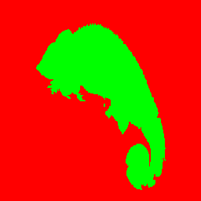
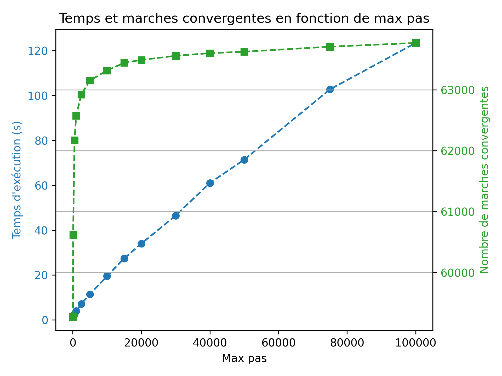
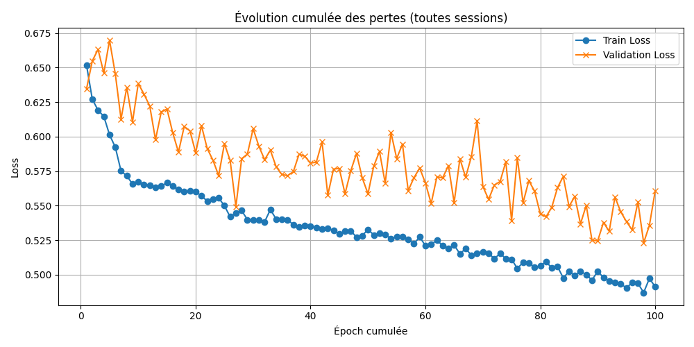

# Segmentation d'image par marches aléatoires

TIPE de CPGE MP2I/MPI (2024-25) sur le thème « Transition, transformation, conversion ».
Auteur : Dorian Courcelle.

L'objectif est de séparer un objet du fond d'une image. On part d'un algorithme
**semi-automatique** : l'utilisateur place quelques pixels « graines » (seeds), puis des
marches aléatoires sur le graphe des pixels propagent les étiquettes. On l'optimise, puis
on le rend **entièrement automatique** grâce à un petit réseau de neurones convolutif qui
place les graines tout seul.

📄 [Présentation du TIPE (PDF)](docs/TIPE_presentation.pdf)

<p align="center">
  
</p>

## Fonctionnement

1. **Graphe de pixels** : chaque pixel est un sommet relié à ses 4 voisins. Le poids d'une
   arête vaut `exp(-d² / σ²)`, où `d` est la distance entre les couleurs des deux pixels.
2. **Marches aléatoires** : depuis chaque pixel non étiqueté (dans un ordre aléatoire), on
   marche de voisin en voisin avec une probabilité proportionnelle aux poids, jusqu'à
   atteindre un pixel déjà étiqueté. Le pixel de départ prend cette étiquette. Au-delà de
   `max_steps` pas, il prend l'étiquette de la graine la plus proche.
3. **Graines automatiques** : `MiniSeedNet`, un CNN encodeur-décodeur (~8 k paramètres),
   prédit pour chaque pixel la probabilité « objet » / « fond ». On place des graines dans
   les zones où il est confiant (probabilité > 0,9), puis on lance les marches.

## Résultats

**Nombre de pas maximal** (image 256×256, 784 graines, 64 752 marches) :

| Pas max | Marches convergentes | Temps |
|--------:|---------------------:|------:|
| 50      | 91,5 %               | 1,4 s |
| 5 000   | 97,5 %               | 11 s  |
| 20 000  | 98,0 %               | 34 s  |
| 100 000 | 98,5 %               | 123 s |

Le temps croît linéairement alors que la qualité sature : 20 000 pas est un bon compromis.



**Pondération des arêtes.** Sur une image texturée (chat siamois sur moquette), comparer
les couleurs moyennes d'un voisinage (`weight_method="patch"`) plutôt que celles des pixels
seuls (`"rgb"`) donne une segmentation nettement plus propre, en 40 s au lieu de 65 s
(σ = 2 et 80 000 pas contre σ = 6 et 30 000 pas).

**Réseau de neurones.** Entraîné sur les 795 images de chats d'Oxford-IIIT Pet
(80 % entraînement / 20 % validation), pendant 1 000 epochs (loss d'entropie croisée
pondérée, Adam).



La chaîne automatique fonctionne bien sur des images simples (fond uni) et échoue quand le
fond ressemble à l'objet (herbe / pelage tigré) : voir la présentation, diapos 34-35.

> Évaluation quantitative (IoU sur les images de validation) : `python evaluate.py`,
> voir ci-dessous.

## Organisation du dépôt

```
segmentation/          code réutilisable
  graph.py             graphe pondéré (liste d'adjacence)
  random_walker.py     segmentation par marches aléatoires
  seednet.py           CNN MiniSeedNet + génération des graines
  dataset.py           chats d'Oxford-IIIT Pet + cartes de graines cibles
app.py                 interface Tkinter (placer des graines, presets, segmenter)
train.py               entraînement du CNN
evaluate.py            IoU / Dice : CNN seul vs CNN + marches aléatoires
models/                poids du modèle final
data/images/           images de test ; data/presets.json : graines sauvegardées
results/               figures, logs, suivi de l'entraînement
notebooks/             carnets de travail d'origine (archives)
docs/                  présentation, MCOT, journal de bord
```

## Utilisation

```bash
pip install -r requirements.txt

python app.py                                  # interface graphique
python train.py --epochs 50                    # entraîner (télécharge le dataset, ~800 Mo)
python evaluate.py --skip-rw                   # IoU du CNN seul (rapide)
python evaluate.py --n 10 --max-steps 20000    # IoU de la chaîne complète sur 10 images
```

Dans l'interface : *Choisir couleur* puis cliquer sur l'image pour poser des graines
(une couleur par région), puis *Segmenter l'image*. *Charger preset* permet de recharger
des graines déjà placées (ex. `cameleon_256`).

## Limites et pistes

- La marche aléatoire est écrite en Python pur : ~20 s à plusieurs minutes par image.
  Pistes : paralléliser les marches, ou résoudre directement le système linéaire
  équivalent (formulation de Grady, voir ci-dessous), ce qui donne les probabilités
  exactes en une seule résolution.
- Le CNN est volontairement très petit : un U-Net avec connexions résiduelles, ou de
  l'augmentation de données, amélioreraient les graines sur les fonds complexes.

## Références

- L. Grady, *Random Walks for Image Segmentation*, IEEE TPAMI, 2006.
- O. M. Parkhi et al., *Cats and Dogs*, CVPR 2012 (dataset Oxford-IIIT Pet).
- L'approche « circuit électrique » présentée dans le TIPE a été testée avec l'implémentation
  open-source [MB-29/Random-Walker-Image-Segmentation](https://github.com/MB-29/Random-Walker-Image-Segmentation).
